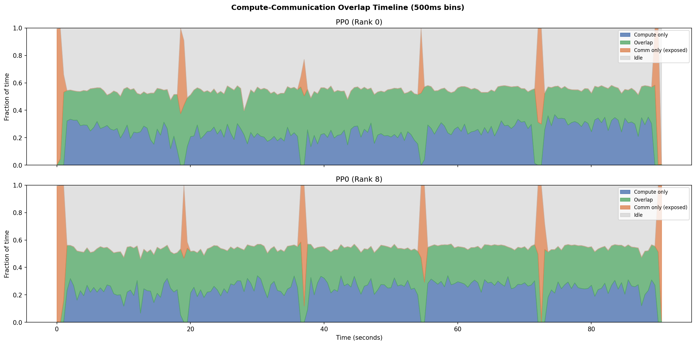
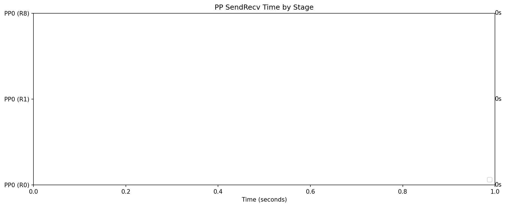
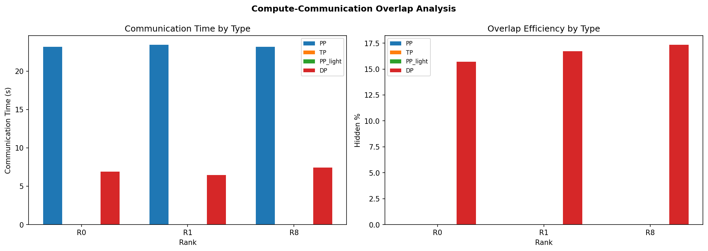

# 30b Profile — 64×B200 SXM 192GB

**Config**: BF16 | 8 nodes × 8 B200 SXM 192GB | TP=1 PP=1 CP=1 VP=1 DP=8 | GBS=4096 MBS=2 Seq=4096

## Key Metrics

| Metric | Value | Notes |
|--------|-------|-------|
| Step time | 17.87s (±0.070s) | Stable across profiled steps |
| Throughput | 938933 tokens/sec | 14671 tokens/sec/GPU |
| MFU | 27.4% | Below typical 35-45% target (2250 TFLOPS peak BF16) |
| Pipeline bubble | 31.0% avg | Theoretical 0.0% |
| Compute : Communication | 58% : 42% | Balanced |

## Communication Breakdown by PP Stage

| PP Stage | Compute (s) | All Comm (s) | PP SendRecv (s) | Idle % | Exposed Comm (s) | Eff. Compute |
|----------|-------------|-------------|-----------------|--------|-------------------|--------------|
| PP0 | 41.1 | 29.6 | 0.0 | 31.0% | 28.5 | 59.1% |

## Compute-Communication Overlap

| Comm Type | PP0/PP1 Time (s) | PP0/PP1 Hidden | PP2/PP3 Time (s) | PP2/PP3 Hidden |
|-----------|-------------------|----------------|-------------------|----------------|
| PP | 23.3 | 0% | 0.0 | 0% |
| DP | 6.9 | 17% | 0.0 | 0% |
| **Total** | **30** | **4%** | **0** | **0%** |

## Root Cause

Communication overhead accounts for 42% of GPU kernel time, with pipeline-parallel SendRecv being the dominant contributor. The effective compute efficiency ranges from 59.1% to 59.1% across PP stages.

## Recommendations

1. **Consider VP=2** if pipeline bubble exceeds 5%
2. **Current PP=1 is already minimal**
3. **Enable `batch_p2p_comm=True`** — batches all P2P ops into one NCCL group call
4. **Enable `overlap_p2p_comm=True`** — overlaps PP SendRecv with compute on separate CUDA streams
5. **Verify EFA/network configuration** — confirm `FI_EFA_USE_DEVICE_RDMA=1` and placement groups

---

## Appendix: Analysis Plots

